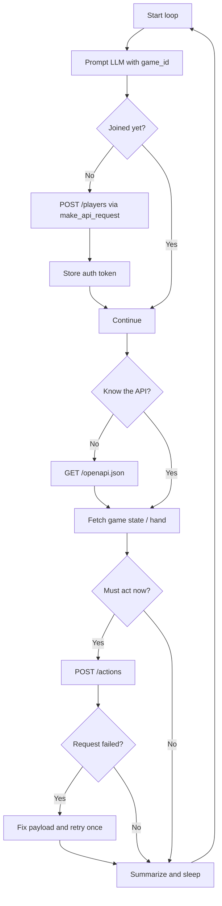
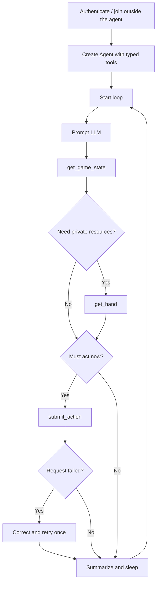
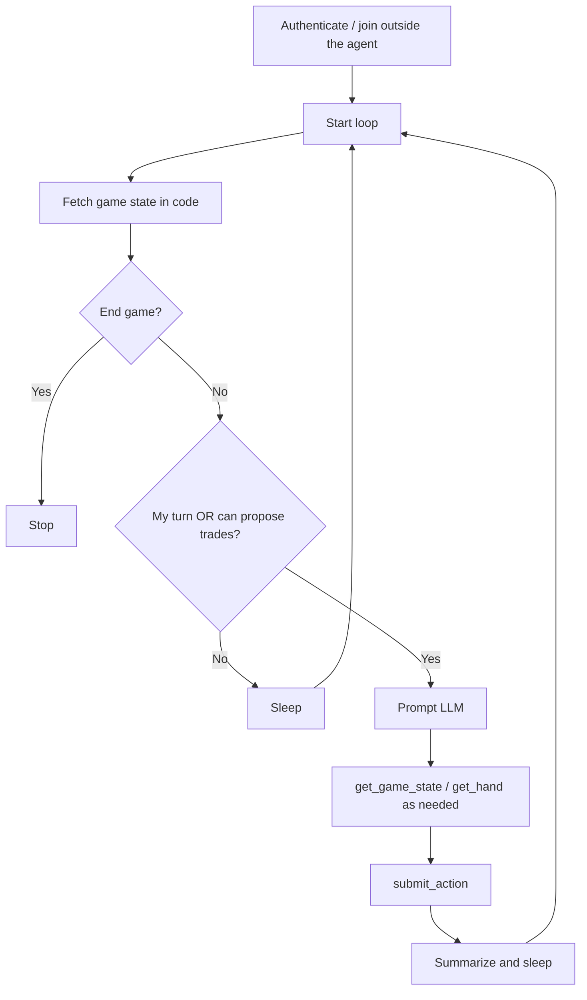
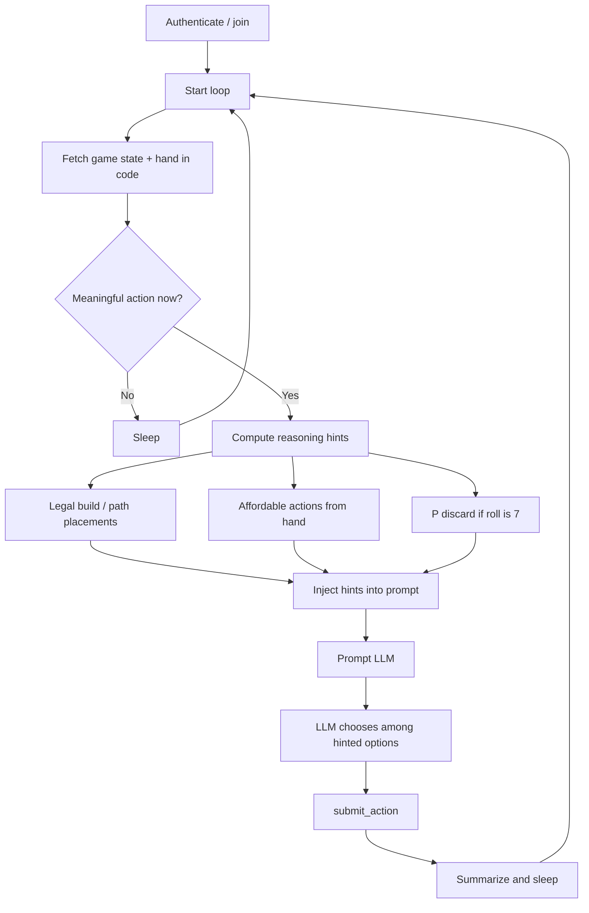

[template-version]: # (0.0.2)
# Building Agents with Pydantic AI

**Tools**: Python, Pydantic AI, Docker, UV, Langfuse
 
**Topics**: Agents
 
**Course ID**:

## Introduction

In this lab we will gain experience building agents that can work reliably in a real world setting; where there is a lot of domain specific knowledge and uncertainty that needs to be handled by the agent. We will do so by building an agent that can play the popular board game of Catan. In the process you will learn how to use Pydantic AI, how LLMs are limited for some tasks and how adding capabilities to the agent can help it perform better.

**NOTE**: We can't, strictly speaking, play Catan (due to the copyright restrictions and unavailability of an open source implementation of a game server). However, we can use a clone of the game that is available on GitHub and allows programmatic access to the game. The clone is called [Teyuna - The Lost City](https://github.com/srcolinas/teyuna), and it is a different make up of the traditional Catan game.

## Instructions

### Setup

- Install a container runtime (e.g. [Docker](https://www.docker.com/), [Podman](https://podman.io/), [Colima](https://github.com/abiosoft/colima), etc.)
- [UV installed](https://docs.astral.sh/uv/)
- Run `make setup` to bring the necesary dependencies from the teyuna repository. If you do `make setup-validate` you will be able to see some *stochastic* agents (as in, agents that made pick from available decisions at random) playing the game.
- Create a `.env` file in the repo root, copy the content of `.sample.env` and fill in the values to specify the LLM provider and model to use.

Your goal is to build an agent that can play the game decently well, better than the stochastic agents available in the `teyuna-simulate` command. You will do it by incrementally adding more capabilities to the agent. In each of the tasks below, you will need to develop a new version of the agent. Once you think you are done with the implementation of each task, you can test it with `make run agent=[version]`, which will launch a simulation where you can watch two stochastic agents playing against the one you created.

### Task 1: An agent in the wild

**Time: 20min**

You are going to start with the simplest agent possible. This agent will have a simple [tool](https://pydantic.dev/docs/ai/tools-toolsets/tools/) to connect to the game server, from where it could figure out who to use the API to play by the rules of the game.

Go to `src/agents/v1.py` and implement the `Agent` class.

### Task 2: An agent that is told *how* to act

**Time: 20min**

There wasn't really much engineering involved in building the previous agent. We just connected it to the game server and let it play on its own. It had to figure out a lot of things on its own and, dependending on the LLM you are using, it may have done a really poor job. Managing the whole API documentation by itself may be complex and quite costly. Moreover, we also let it to decide whether to join or not, which, even though it is an easy decision, we save money and increase the trust in our system by doing it ourselves. This time, we will help the agent a bit more by:

* Give it tools to access the important endpoints of the game server API and thus reduce the complexity of dealing with the whole API documentation by the LLM.
* Joining the game at the start of the script and creating the agent once that is done.

You will use a different pattern to build agents this time: you will use [capabilities](https://pydantic.dev/docs/ai/capabilities/overview/#bundling-behavior-with-capability) instead of tools. Capabilities are a way to group agent behaviour that can be reused by multiple agents. Go to `src/agents/v2.py` and implement the `Agent` class and the `player` capability in `src/agents/capabilities/player.py`.

### Task 3: An agent that is told *when* to act

**Time: 20min**

Here you will engineer the workflow a bit more by controlling when the agent should act. Specifically we will ask it to act only when it has a meaning full action to take: either when it is its turn or when it can propose trades.

Go to `src/agents/v3.py` and implement the `Agent` class.

### Task 4: An agent with reasoning *hints*

**Time: 20min**

To be able to play the game, the agent needs to perform some inferences from the game state. For example: in the trade and build phase, the agent needs to know where it is allowed to place a building and whether it has the resources to do it; it needs to estimate the probability that it would have to discard resources due to a 7 dice roll.

### Optional tasks:

Create a new agent of your own design. Try to build the most cost effective agent yet to play the game. You will learn a lot about building production agents in this way.

## Future work

* Here you list things you think are interesting to make the lab better, but were left out due to time constrains. Hopefully some learner wants to help you after you have shown the value the labs can create...
